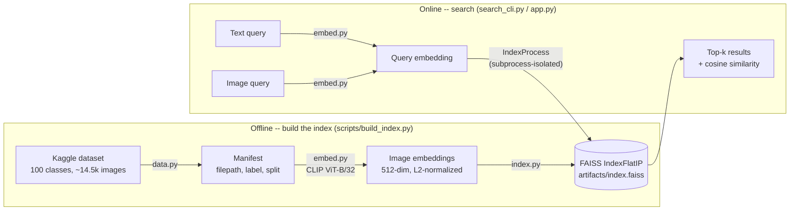
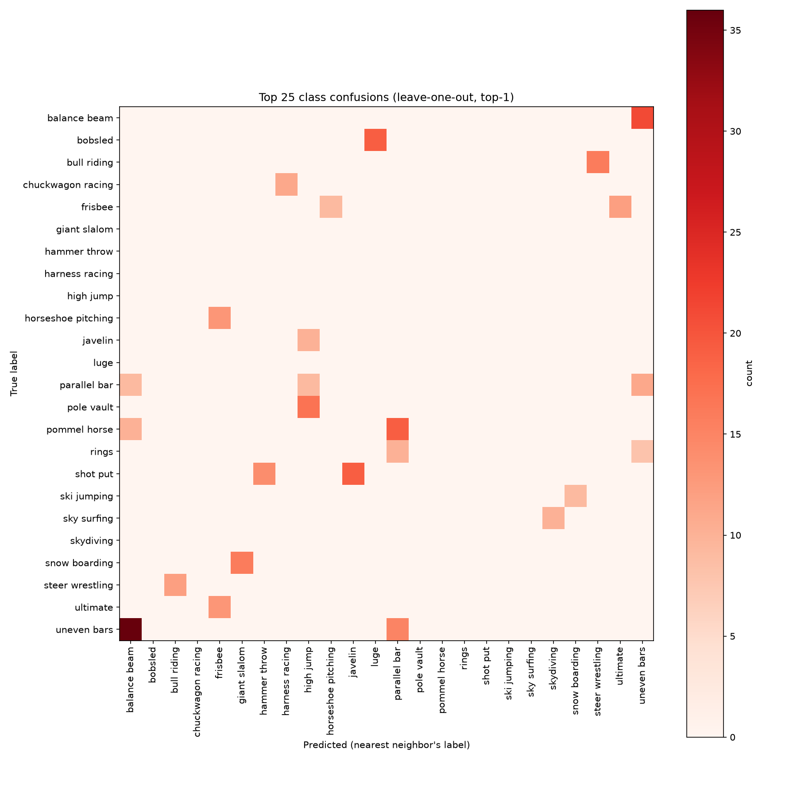

# Multimodal Sports Retrieval


Search ~14,500 sports action photos (100 classes) by **uploading a photo** or **typing a description** — "diving into a pool", "swinging a golf club" — and get back the most visually/semantically similar images. Both query types are embedded with the same pretrained **CLIP** model into one shared vector space and searched with **FAISS**. Inference-only: nothing is trained, everything runs on a MacBook Air's CPU/MPS in minutes.

## Why this exists

A classifier tells you "this is golf." A retrieval system finds every image that *looks and reads* like golf — including ones you'd never think to hand-label, from a query as loose as a sentence. That's the more useful primitive behind visual search, recommendation, and dedup at scale, and it doesn't require training a single model: a good pretrained embedding plus an exact nearest-neighbor index gets you most of the way there. This project builds that pipeline end to end and evaluates it honestly against the dataset's own labels, rather than eyeballing a few results and calling it done.

## Architecture



The one non-obvious piece: `search()` in the online path runs in a **dedicated subprocess**, not in-process. FAISS and PyTorch each bundle their own OpenMP runtime, and calling `index.search()` in the same process as a loaded torch/MPS model reliably segfaults on macOS/Apple Silicon — confirmed during development, and not avoidable via `KMP_DUPLICATE_LIB_OK`, single-threading FAISS, or forcing torch to CPU (all three were tried; all three still crashed under sustained load). `IndexProcess` isolates the actual `search()` call in a subprocess that never imports torch, sidestepping the conflict entirely. See [index.py](src/sports_retrieval/index.py)'s `IndexProcess` docstring for the full writeup, including a second, subtler manifestation of the same bug (macOS's `spawn` start method re-executes a launching script's top-level imports inside the "isolated" subprocess too).

## Results

Evaluated against the dataset's own class labels — not eyeballed. Full methodology and numbers: [eval.py](src/sports_retrieval/eval.py), reproduce with `python scripts/run_eval.py`.

**Text-to-image** (each of the 100 class names, as `"a photo of {label}"`, is a query; do the top-k results match?)

| Metric | Value |
|---|---|
| Mean precision@10 | **0.829** |
| Mean recall@10 | 0.059 |

Recall@10 looks low in isolation but is close to its ceiling: classes average ~145 images, so retrieving 10 caps recall around 10/145 ≈ 0.07 even with perfect precision. 61/100 classes hit precision@10 = 1.0. The 4 that scored 0.0 — `parallel bar`, `barell racing` (the dataset's own typo, not mine), `figure skating men`, `rings` — are exactly the ambiguous or awkwardly-phrased class names (is "rings" jewelry or gymnastics? is "parallel bar" gymnastics or a place to get a drink?), not random misses. That's a real signal about where a single fixed prompt template breaks down, not noise.

**Image-to-image** (leave-one-out: every image queries the index with itself excluded; do its neighbors share its class?)

| Metric | Value |
|---|---|
| Mean precision@10 | **0.871** |
| Top-1 accuracy | **0.926** |

**Confusion breakdown** — where retrieval gets it wrong, it's wrong in ways that make sense:

| True label | Confused with | Count |
|---|---|---|
| uneven bars | balance beam | 36 |
| balance beam | uneven bars | 21 |
| pommel horse | parallel bar | 19 |
| shot put | javelin | 19 |
| bobsled | luge | 19 |
| pole vault | high jump | 17 |
| snow boarding | giant slalom | 16 |
| bull riding | steer wrestling | 16 |

Gymnastics apparatus confuse each other, track-and-field throwing events confuse each other, winter sliding sports confuse each other, rodeo events confuse each other. A model making *these* mistakes is picking up on real visual structure, not guessing randomly.



## Demo

```bash
python scripts/app.py
```

Opens a Gradio UI at `http://localhost:7860`: upload a photo or type a description on the left, get a top-k gallery with per-result labels and cosine similarity scores on the right. Three example photos are bundled so it works out of the box — note that those specific examples are already *in* the search index, so querying with one trivially returns itself as the #1 result (score 1.000). Upload your own photo to see genuine out-of-distribution retrieval.

Verified live end-to-end during development (text queries correctly top-rank their class, image queries correctly self-match then surface same-class neighbors).

<!-- TODO: add a screenshot or short GIF of the running app here -- run `python scripts/app.py`, try a text and an image query, and capture the UI. -->

## Setup

Requires Python 3.10+, a Kaggle account, and (for the fastest path) [`kagglehub`](https://github.com/Kaggle/kagglehub) credentials.

```bash
git clone https://github.com/av421/multimodal-sports-retrieval.git
cd multimodal-sports-retrieval
python3 -m venv .venv
source .venv/bin/activate
pip install -e ".[dev]"
```

**Kaggle auth** (needed once, before the first data download): get an API token from [kaggle.com/settings](https://www.kaggle.com/settings) and either

- save it as `~/.kaggle/access_token` (Kaggle's current single-token scheme), or
- save the legacy `username`/`key` pair as `~/.kaggle/kaggle.json`

`kagglehub` picks either up automatically.

> **macOS + pyenv troubleshooting**: if `import torchvision` (or anything touching `lzma`) fails with `ModuleNotFoundError: No module named '_lzma'`, your Python was built without `liblzma` — a common pyenv gap. Either `brew install xz && pyenv install --force <version>`, or (less invasive, what this project's venv actually uses) build the venv on a Python that already has it, e.g. Homebrew's: `brew install python@3.12 && /opt/homebrew/opt/python@3.12/bin/python3.12 -m venv .venv`.

## Usage

Run in order — each step's output feeds the next:

```bash
python scripts/download_data.py              # sanity-check the Kaggle download + manifest
python scripts/build_index.py                # embed all images (CLIP, MPS) + build FAISS index (~90s)
python scripts/run_eval.py                   # precision@k/recall@k + confusion breakdown (~1 min)
python scripts/search_cli.py --text "diving into a pool"   # quick CLI search
python scripts/app.py                        # Gradio demo
```

`build_index.py` and `run_eval.py` write to `artifacts/` (gitignored — regenerate anytime, nothing is committed there). Both accept `--max-per-class N` / `-k N` to trade off speed vs. thoroughness while iterating.

Run the test suite:

```bash
pytest
```

23 tests, no GPU or full dataset required beyond what's already cached locally.

## Project structure

```
src/sports_retrieval/
    data.py     Kaggle download + manifest (filepath, label, split)
    embed.py    CLIP (open_clip ViT-B/32) image + text embedding
    index.py    FAISS index build/save/load + process-isolated search
    search.py   unified SearchEngine (image or text -> top-k results)
    eval.py     precision@k/recall@k, leave-one-out, confusion breakdown
scripts/        thin CLI entrypoints around the library above
tests/          23 tests -- unit tests for pure logic, integration tests
                against the real CLIP model where that's the point
```

## Limitations / what I'd improve

- **Zero-shot only, no fine-tuning.** CLIP's pretrained embeddings are used as-is. A linear probe or lightweight adapter fine-tuned on this dataset's training split would likely sharpen exactly the confused pairs above (gymnastics apparatus, throwing events) — they're visually close in *general* image space but the training labels contain the signal to pull them apart.
- **One fixed prompt template.** `"a photo of {label}"` is what OpenAI's CLIP paper calls a single-template zero-shot baseline; their own results show ensembling multiple templates (`"a photo of a person doing {label}"`, `"a photo of the sport {label}"`, ...) and averaging improves exactly the ambiguous-wording failures seen here (`rings`, `parallel bar`, `gaga`).
- **Exact search doesn't scale past ~100k-1M vectors.** `IndexFlatIP` is brute-force cosine similarity — correct and fast enough at 14.5k images (full leave-one-out over all of them takes ~0.3s), but an approximate index (HNSW, IVF-PQ) would be needed at real scale.
- **Fixed k for recall@k** understates classes with many images (see Results). R-precision (recall at k = class size) would be a fairer per-class number; I used a fixed k because it's the more standard/interpretable metric and reported the ceiling effect explicitly rather than picking a metric that flatters the result.
- **Local demo only.** The Gradio app runs on localhost; a next step would be deploying it as a public Hugging Face Space so the link in this README is clickable, not just runnable.

## Dataset & acknowledgments

[100 Sports Image Classification](https://www.kaggle.com/datasets/gpiosenka/sports-classification) (gpiosenka, Kaggle) — 100 classes, pre-split train/valid/test, used here only for its images and ground-truth labels (evaluation), never for training.

## License

MIT — see [LICENSE](LICENSE).
